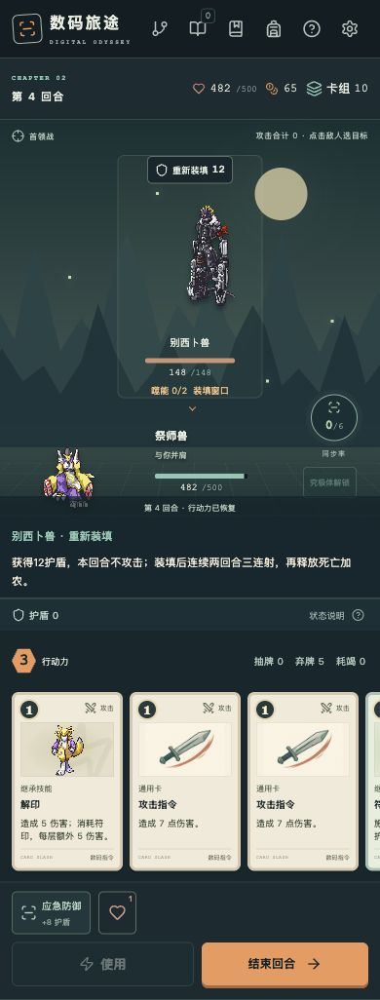

# 敌人 AI 优化与验收

日期：2026-10-09。依据[敌人 AI 设计审核](敌人AI设计审核.md)及用户执行指令实施。现行规则见[项目说明](../项目说明.md)。

## 实施边界与设计

目标是提高行动的可信度、编队职能与节奏差异，保留固定意图和玩家主动干预。新编队的相位与数值修正随地图及战斗保存；旧存档不补生成阵容，缺少修正字段时维持原阵容与起始相位。

界面沿用像素终端风格与现有配色、字体，在敌人状态条和机制说明处补充力量、护卫、噬能、狂暴、爆发倒计时，并显示整队攻击合计；手机状态条允许换行。

验收要求：

- [x] 整队预告与逐敌实际结算一致；增益者击杀、治疗跨越半血、前序召唤、队列中途保存均能正确刷新；预告不改变存档或随机状态。
- [x] 散射每张牌对每个实际损失生命的敌人计一次有效攻击；全格挡不计，致死命中计数，打断与反击符合说明。
- [x] 护卫仅拦截指定攻击，纯状态与群攻尊重目标；选择护卫本身不被另一个护卫转移。
- [x] 别西卜兽循环为三连射、三连射、加农、装填；装填不攻击、不积攒噬能。
- [x] 第三章车棋／相棋拥有预算受控的固定双人精英编队；机械三人组错开相位并降低每段基础伤害。
- [x] 贝尔菲兽爆发、两种穿透与核心增援成长经过实际场景校准；原生鼓舞敌人保持自身特色。
- [x] 新字段兼容旧存档，完整测试、静态检查、构建及浏览器验证完成。

## 规则与数值

| 场景 | 优化前 | 优化后 |
| --- | --- | --- |
| 鼓舞与突击 | 预告8，实际10 | 预告10，实际10；鼓舞者倒下预告即时降至8 |
| 别西卜兽 | `18→18→18`重复，无装填 | `18→18→18→0`；装填12护盾 |
| 流水线三班 | `0→36→36` | `20→20→20`，各自相位偏移0／1／2、基础攻击系数0.85 |
| 车棋兽精英 | 单只99生命，无护卫对象 | 车棋兽62生命＋白兵棋25生命，前三回合整队`7→16→12` |
| 相棋兽精英 | 单只87生命，仅自疗 | 相棋兽63生命＋白马棋28生命，前三回合整队`7→7→9`；支援能强化、治疗队友 |
| 贝尔菲兽 | 睡眠20盾，觉醒45总伤害 | 睡眠16盾，觉醒39总伤害 |
| 莉莉丝兽／灭世魔兽 | 穿透14／21 | 穿透12／18，保留无视护盾和虚弱应对 |
| 帝厉魔核心 | 不清增援，第8／12回合整队69／81 | 同条件64／70；召唤复制体鼓舞每段＋1、力量至多6 |

车棋编队的主怪生命／基础攻击系数为0.62／0.8，兵棋为0.7／0.6；相棋为0.72／0.85，马棋为0.6／0.7。僚机起始相位固定偏移1。基础攻击先按系数四舍五入，再加入力量、软狂暴和虚弱；生命缩放和章节倍率相乘后向上取整。上表使用真实章节初始化，未对敌人补状态。

整队预告在状态副本上推演，用与真实结算共用的攻击、治疗、力量和召唤效果；故障牌生成留在真实动作中，预告不调用随机。究极魔兽、巴鲁巴兽新增明确的自身增益目标。原生复制体、小恶魔兽仍鼓舞全体每段＋2；上限仅用于召唤复制体的鼓舞，不主动降低已有高力量。

## 验证结果与限制

- 本轮新增72项敌人AI回归，包括54套普通阵容连续12回合的逐段预告与实际伤害比较，以及增益顺序、治疗变招、召唤、存档、散射和护卫边界。
- 收尾完整测试414项通过，类型、代码检查和生产构建通过。顺带补全已有循环检查夹具的数组类型声明，未改变其规则。
- 9个重点场景各记录前后16回合，优化后预告总攻击与零护盾实际伤害不一致次数为0。
- 固定防守策略、合法形态牌组、前后相同当前卡牌、8个种子，共1088场战斗；使用100初始生命、守护祝福、防御训练，无装置及额外道具。它们是固定场景对照，不是完整旅途或玩家胜率。

| 固定场景 | 前／后平均净损血 | 前／后策略胜出 |
| --- | --- | --- |
| 流水线三班 | 16.90／5.79 | 48／48 → 48／48 |
| 车棋编队 | 2.02／2.27 | 48／48 → 48／48 |
| 相棋编队 | 1.04／2.83 | 48／48 → 48／48 |
| 别西卜兽 | 2.48／3.75 | 48／48 → 48／48 |
| 贝尔菲兽 | 55.93／33.27 | 77／88 → 83／88 |
| 莉莉丝兽 | 24.38／21.02 | 88／88 → 88／88 |
| 灭世魔兽 | 68.72／59.77 | 78／88 → 85／88 |
| 帝厉魔核心 | 79.11／71.35 | 44／88 → 59／88 |

别西卜兽加入装填盾后，固定策略平均回合10.40增加至11.90、净损血略增；提供明确输出窗口并不意味着所有策略必然更省血。葛叶兽的固定牌组对贝尔菲兽，前后各5场达到24回合诊断上限，均未计为胜出；没有新增加的超限案例，仍需真实构筑试玩。详见[固定场景报告](../reports/enemy-ai-round1-20261009.md)及其原始数据。

浏览器使用独立本地端口的测试存档验证真实页面与队列：桌面“鼓舞与突击”预告10、结束回合生命500降至490；手机指定时钟兽使用符咒，符印3落到时钟兽而非骑士兽；别西卜兽加农后进入第四回合，预告0、噬能0／2、装填窗口与12盾意图可见。390×844下核心的力量／狂暴／脉冲倒计时换行正常，页面宽度390，无横向溢出，检查的页面无控制台错误或警告。

## 后续观察

保留满血治疗的固定喘息窗口。后续以人工试玩和更广泛旅途样本检查：机械编队首回合从0增加至20的压力、穿透对纯防御构筑的差异、葛叶兽低输出牌组与沉睡盾的拉锯，以及核心及时清增援策略的效果。当前没有根据有限策略强行保证所有路线每场必胜。

审核入口：`npm run audit:enemies -- --label <标签> --count 8`。可用`--baseline <冻结引擎路径>`做配对对照；默认仅审核当前规则。报告写入`docs/reports/`，含牌组、种子与源码哈希。
