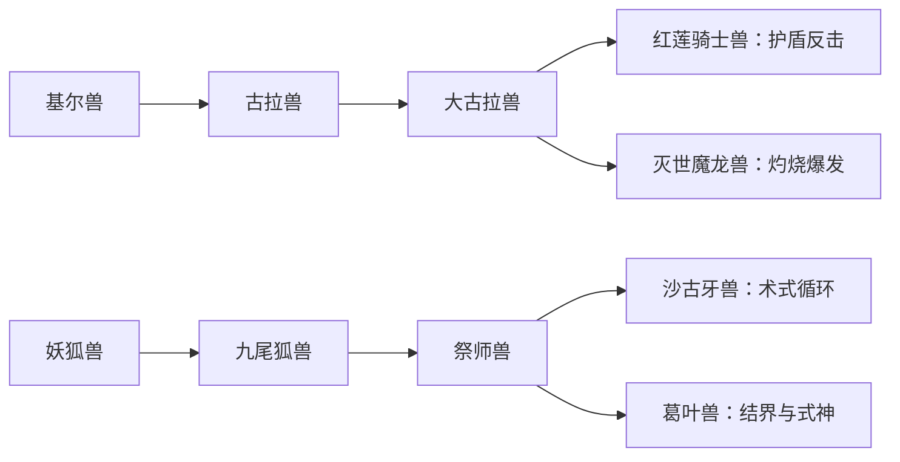

# 分支进化：把路线选择变成牌组构筑

> 设计归档：本文包含早期目标和后续提案。当前已实现范围与数值见[项目说明](../项目说明.md)。

2026-09-27 · v0.2 已实现成熟期分支、横向进化树、本局行为门槛、跨局资料解锁、目标追踪及营地补进化。下文保留早期设计讨论，其中旧路线与“无行为硬门槛”等表述已由新规则替代；当前可玩规则见 README.md 和本轮开发说明.md。退化重构、合步进化仍为后续提案。

**核心循环：扫描发现更多路线 → 根据本局卡牌选择进化 → 新形态改变玩法 → 保留一项旧形态能力，形成自己的搭档。**第三部提供人物、世界与卡片抽换主题，进化网络可参考其他数码宝贝作品，不局限于动画演出的唯一主线。

## 1. 先做得出来的两处分支

以下为本作选用的路线与平衡设计，不声称所有箭头都来自《日光／月光》或第三部动画。具体进化条件、战斗效果均由本项目设计。

基尔兽经大古拉兽走向红莲骑士兽或灭世魔龙兽，在《日光／月光》公开进化攻略中有对应记录。[进化攻略](https://gamefaqs.gamespot.com/ds/937344-digimon-world-dusk/faqs/49842)

妖狐兽的葛叶兽分支参考官方角色设定与其他游戏／卡牌表达，本作采用“祭师兽→葛叶兽”，不将它标成《日光／月光》原样路线。葛叶兽的官方设定涉及古代法术、管狐与净化结界，不应仅因配色就认定它是失败进化或邪恶版本。[葛叶兽图鉴](https://digimon.net/reference/detail.php?directory_name=kuzuhamon) · [官方葛叶兽卡牌](https://digimoncard.com/cards/index.php?card_no=EX4-030&search=true)

| 终点 | 构筑方向 | 形态被动草案 | 标志牌草案 |
|---|---|---|---|
| 红莲骑士兽 | 防御反击 | 每回合首张防御牌额外获得 3 护盾 | 皇家枪击：攻击同时获得护盾 |
| 灭世魔龙兽 | 灼烧、耗竭爆发 | 每回合首次施加灼烧，额外＋2 层 | 灭世烈焰：高额群攻并追加灼烧，自损 3 生命、耗竭 |
| 沙古牙兽 | 符印、术式循环 | 每回合首次消耗符印，抽 1 张牌 | 结界术：获得护盾并消耗符印抽牌，耗竭 |
| 葛叶兽 | 结界、式神 | 每回合打出第二张技能牌后，式神造成 4 伤害；每回合一次 | 管狐术：造成伤害并获得护盾，偏向稳定消耗战 |

这些效果是玩法提案。灭世魔龙兽的自损必须在出牌前展示，玩家主动承担代价；不因生命偏低或某次失败强制走黑暗路线。葛叶兽作为平行选择参与平衡，不做沙古牙兽的下位替代。

本地已有上述所有形态的源 GIF，包括 `Megidramon.gif`、`Kuzuhamon.gif`；新增两者尚未统一导出。后续可增加已有素材 `ChaosDukemon.gif` 对应的混沌骑士兽路线，具体连接另行核对。

## 2. 不止在终点分岔

正式目标是在成熟期或完全体就出现选择，让路线影响本局大部分战斗。第一轮先用两个究极体分支验证“进化能否改变打法”，随后前移分岔。

例如妖狐兽可以扩成两条完整方向：

- 妖狐兽 → 九尾狐兽 → 祭师兽 → 沙古牙兽：符印与术式循环。
- 妖狐兽 → 妖狐兽（Youkomon，成熟期，中文名需避免与 Renamon 混淆）→ 道士兽（Doumon）→ 葛叶兽：结界与式神。

第二条是本作候选连接，采用前逐条记录所参考作品／卡牌；Youkomon、Doumon 在本地素材库中尚未找到，需补素材。不能简单把九尾狐兽、祭师兽换色后当作已完成。

每个节点先限制为 2～3 个后继，不做所有角色互相进化。首轮地图提前展示两个终点的玩法；进入成熟期时先选择对应训练方向，给予小幅构筑效果，让终点分支在中段已有预兆。阶段补齐后，再用真实不同形态承载这些方向。

## 3. 进化如何影响手牌

每次进化获得“一项形态被动＋两张关键牌的转换”，不把整个卡组重置：

1. 通用卡和旧形态招牌技能继续可用，避免进化后半副牌变成废牌。
2. 玩家选两张符合条件的卡，替换成新路线的关键牌；可预览替换前后效果、费用及升级版本。
3. 既有强化次数保留，牌组张数不变。新路线奖励提高出现权重，但仍允许跳过及选择通用牌。
4. 能力不是无限叠加：新形态被动替换旧形态被动；另设一个“继承槽”，只允许保留一项历史形态的弱化版能力。

示例：前期用火球叠灼烧，到了分支节点发现防御牌与护盾装置更好，可转红莲骑士兽，将两张低效攻击换成攻防兼备牌；继续使用火球，并在继承槽留下“每回合第一次施加灼烧额外＋1”。另一局抽到耗竭、群攻配合，就转灭世魔龙兽。

继承槽每次进化可以免费重选已获得的合格能力；新一局清空，局外收集不永久增加继承槽数量。复制、免费抽牌与返费能力不作为首版继承项，避免形成无限循环。

## 4. 扫描与进化怎么连接

扫描同时承担“转化伙伴”和“解锁进化研究”两个用途，使用同一份物种进度，不再新增一种刷取货币。

- 基础两条分支默认可选；第一局就能体验不同终点，不能要求反复刷怪后才有分支。
- 稀有路线可通过“指定物种扫描 100%”或“两个相关标签物种扫描完成＋一个研究事件”永久开放资格，两种方式择一即可。
- 路线资格跨局保留；具体形态、牌组和继承能力属于本局，下局重新选择，不增加永久攻击力。
- 本局进化只要求到达固定节点并选择已开放路线。牌组标签用于推荐方向，不是硬门槛，避免拿不到某张随机卡就不能进化。
- 不要求先碰见想进化成的稀有究极体。普通敌人的资料与研究事件也能打开该路线，避免“先拥有才能解锁”的循环依赖。

例如额外的混沌骑士兽路线，可设计为完成两种“暗系”物种扫描＋对应研究事件后开放；这是原创解锁条件，尚非最终数值。标签只是研究分类，不意味着所有暗系数码兽都有同一条官方进化关系。

采用此方案后，原《敌人与扫描系统建议》的最小验证版应调整为：所有数码兽对手记录扫描进度，先只开放三个支援转化；其他已完成资料可参与路线研究，界面分别标明“支援可转化”和“研究用途”。帝厉魔仍不转化为普通伙伴。

## 5. 进化时点、转路线与同步爆发

建议调整旧版“究极体只维持三回合”的规则：**选中的形态保留到本局结束，同步爆发仍是限时能力。**这样玩家选择的葛叶兽或灭世魔龙兽可以持续参加第三章战斗。

- 第 1 章中段：成熟期；第 1 章首领后：完全体；第 2 章首领后：选择究极体分支。进化不自动回血。
- 同步值沿用出牌累计规则：每张牌＋1，每回合最多 3，上限 6；每场从 0 开始。
- 6 点同步可启动一次持续 3 个玩家回合的路线爆发，获得该路线临时必杀牌及明确的限时强化；爆发结束不退化。
- 人兽融合仍是适合角色的表现方式，但不把灭世魔龙兽、葛叶兽等所有分支都宣称为动画中的人兽融合结果。通用按钮称“同步爆发”。

为保留容错，可在每局一次的研究站选择“路线重构”：消耗一次营地行动，改选同阶段、已解锁且允许连接的分支，并同步重选两张路线牌。转换不回血、不复制卡牌、不反复赠送升级；永久退化刷属性与任意换种族暂不加入。

## 6. 手机表现与制作优先级

进化选择页最多并排／纵列展示三个候选，每个只展示角色、流派、一项被动与两张牌的变化；完整进化树另开纵向图鉴。不要把大型横向树压进战斗屏。

如果资源有限，优先做“基尔兽、妖狐兽各两条路线”，再增加第三只初始搭档。缩减角色数量来保证每只角色真的有选择，而不是只增加很多固定终点。

验证目标：同一个初始搭档能因不同选牌而选择不同终点；换路线后没有失效手牌；首局就有两条选择；扫描研究带来新的构筑选项；玩家能看懂本次进化的收益与代价。
