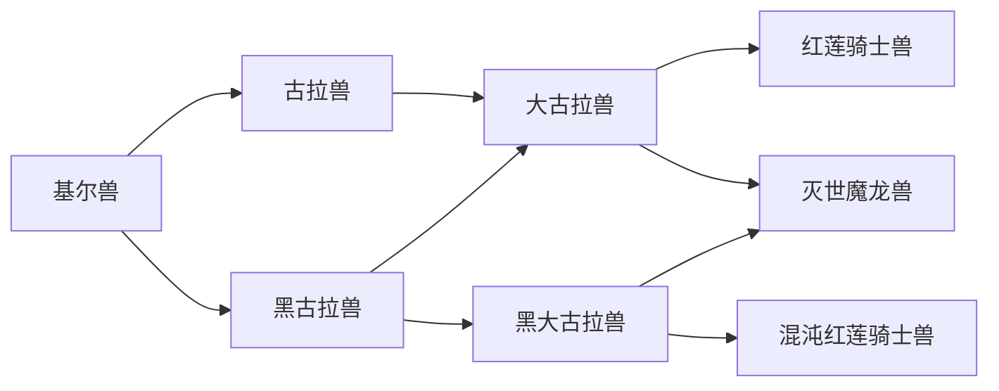

# 基尔兽进化链：卡牌与机制审核

实施状态：以下保留2026-10-09调整前审核。建议现已落地，当前规则、验证及剩余风险见[基尔兽进化链优化结果](./基尔兽进化链优化结果.md)。

日期：2026-10-09。基于当前第二轮卡牌定义、真实引擎、专属技能解锁与进化条件。结论：火焰／物理的共同起点合理，三条终点有区分；暗线灼烧消费出口、混沌恢复来源、主线完全体过渡仍有明显缺口。另复现了一项首次灼烧触发错误。本次只做审核，未修改游戏规则或卡牌。

## 当前路线

共6种合法完整路径。卡池只继承本局经历过的形态，不会因物种相近自动开放平行分支。进化替换玩家选定的两张旧牌，成熟期／完全体赠牌自动强化，究极体保留被替换牌的强化；不是自动删掉两张低价值牌。

| 阶段／形态 | 进化赠牌 | 主要额外解锁 | 实际衔接 |
| --- | --- | --- | --- |
| 基尔兽 | 初始火球、岩石粉碎，另4攻4防 | 勇气咆哮 | 灼烧与直接攻击并存；力量支持岩石粉碎及未来双刃斩 |
| 古拉兽 | 火球＋、岩石粉碎＋ | 烈焰引爆、双刃斩、热浪 | 叠火→引爆，力量→双段，机制合理；赠牌重复基础牌，新增操作依赖奖励 |
| 黑古拉兽 | 暗炎弹＋、血色利刃＋ | 这两张牌 | 强化灼烧并引入自损，为黑大古拉兽准备；尚无恢复或灼烧消费出口 |
| 大古拉兽 | 火球＋、脉冲炮＋ | 原子爆焰、余烬护甲 | 一次初始蓄能支撑炮击；余烬护甲是火焰转守护的桥，但不保证获得 |
| 黑大古拉兽 | 暗炎弹＋、危险过载＋ | 危险过载 | 自损→返能→抽牌连贯；恢复仍依赖通用卡／磁盘 |
| 红莲骑士兽 | 皇家枪击、圣盾守护 | 同左 | 攻防复合牌触发首次护盾加成；盾击可兑现护盾，但实际没有独立反击机制 |
| 灭世魔龙兽 | 灭世烈焰、地狱咆哮 | 同左 | 加强群体灼烧，旧火牌仍有效；暗线无法获得烈焰引爆 |
| 混沌红莲骑士兽 | 混沌枪击、暗黑圣盾 | 同左 | 自损→护盾、枪击→恢复形成血契；黑大古拉兽的返能被动被替换 |

## 需要优先处理的事项

### 1. 首次灼烧触发在未施加灼烧时被消耗（规则问题，优先级高）

证据：[引擎首次灼烧计算](./src/game/engine.ts#L105)、[设置已触发标记](./src/game/engine.ts#L118)。只要打出的牌带burn字段就设置burned，即使直接伤害已杀死目标、实际没有添加灼烧。

复现：两个敌人，第一只剩5生命；同回合先火球击杀它，再对第二只打火球；选择余烬继承、无攻击训练和装置加成。第一只死亡且灼烧0，但burned已经为true。黑古拉兽第二发只叠2层，应为首次实际施加的2＋形态1＋余烬1＝4；灭世魔龙兽第二发也只有2层，应为2＋形态2＋余烬1＝5。

建议：以至少一个存活目标实际新增灼烧为触发条件，再消耗首次机会；群攻仍只触发一次机会、加成作用于有效目标。散热／进攻／同步造成提前击杀时也应一致。防火模块共用这个标记，其触发是否也要求实际灼烧，应一并统一。无需借这次修复改变灼烧数值。

### 2. 暗线转灭世缺少“叠火→引爆”出口（设计缺口，优先级高）

[烈焰引爆](./src/game/data.ts#L19) 只在古拉兽解锁。四条经过黑古拉兽的完整路径均未经过古拉兽，包括黑古拉兽→大古拉兽→灭世，以及黑古拉兽→黑大古拉兽→灭世。因此它们没有引爆牌；终点自己也只提供叠火与直接群伤。

这不会让路线不可达：灭世条件允许“灼烧击杀6次”替代引爆3次。但这意味着两条灭世来源的玩法不同：主线能积累后主动引爆，暗线主要等待灼烧结算。暗线生命压力更高，而灼烧在敌人行动后结算，这个差别会影响生存节奏。

建议：在完全体阶段给两侧各一个可获得的灼烧消费出口；可设计黑大古拉兽专属暗炎消费牌，或显式共享单张基础引爆牌的解锁资格。不要开放未经历形态的整套卡池。若有意保留暗线为持续灼烧，应明确区分终点构筑，而不将其同样宣传为完整引爆链。

### 3. 混沌的治疗门槛早于稳定恢复来源（设计缺口，优先级高）

[混沌条件](./src/game/evolution.ts#L31) 需要自损6、有效治疗4及资料。黑古拉兽／黑大古拉兽赠牌保证自损，未保证恢复。数据修复、生命汲取为通用随机牌；初始磁盘1个，商店可补但仍有路线／金币成本。营地、事件和胜利回复没有贡献有效治疗计数。混沌枪击的稳定回血要进化后才取得，不能帮助取得自身资格。

这不是所有种子都无法进入，而是同一机制的“付出端”保底、“偿还端”随机。第二轮独立模拟混沌200局中目标达成163局；这是固定策略表现，不是玩家胜率。未达成原因主要为治疗次数不足或达标晚于最后进化机会。

建议：在黑大古拉兽阶段提供一次恢复入口选择或可见的保底获取方式，而非先减低4次门槛或把所有营地回复都计入。治疗牌仍保留费用／耗竭／造成实际生命伤害等取舍，避免无成本刷进度。若选择赠牌，不宜直接拿掉危险过载，因为它承担完整体的核心操作。

### 4. 大古拉兽缺少通往两终点的明确桥接（设计问题，优先级中）

大古拉兽保底给予火球＋、脉冲炮＋，被动只提供每场一次1蓄能。持续补充蓄能要依赖通用蓄能指令；炮击也不消费或利用灼烧。它能作为兼容攻击，但没有自然连接红莲护盾或灭世叠火的循环。

余烬护甲已经很适合桥接：防御推进红莲的12次奖励、保留灼烧推进灭世，配合盾击可兑现护盾。实际隔离场景中，选择坚守继承，余烬护甲→盾击：大古拉兽获得10盾、盾击9伤；红莲获得13盾、盾击10伤，无训练与装置攻击加成。因此守护路线并非没有协同，主要是好桥接牌不保证获得。

建议优先调整赠牌：把完全体重复赠送的火球改为余烬护甲，保留脉冲炮和一次初始蓄能。此前火球仍可保留／获取，两种终点均能受益。先做赠牌对照，不急着添加“火焰自动产蓄能”新被动，以免与大耳兽炮击构筑重叠。

### 5. 自损返能→自损护盾是有效转型，但进化预览应讲清楚（优先级中）

被动替换符合原有设计，不等于究极体必须叠上所有旧能力。实测无其他加成：

| 操作 | 黑大古拉兽 | 混沌红莲骑士兽 |
| --- | --- | --- |
| 本回合首个自损：血色利刃 | 花费净0能量，扣3生命 | 花费1能量，扣3生命，获得6盾 |
| 本回合首个自损：危险过载 | 0费，返2能量，扣3生命 | 0费，返1能量，扣3生命，获得6盾 |
| 血色利刃→生命汲取 | 共1能量、净生命0 | 共2能量、净生命0，获得6盾 |

混沌枪击在造成生命伤害且有回复空间时，自损3后回复5，净回血2，并触发首自损护盾；契合血契循环。被完全格挡时不回血、致死自损不能靠随后吸血救回，也有合理风险边界。

建议保留这种进攻→续航转型；在预览中展示“失去旧返能，得到首自损护盾”及旧牌影响。不要直接叠返能＋护盾，再同时增强治疗，容易抹去代价。

### 6. 两个机制名称需要更精确（优先级低）

- “灼烧击杀”目前也统计带灼烧目标被直接攻击击杀；隔离复现中，火球后岩石粉碎直接终结目标，没有等待灼烧结算，也计1次。现有回归明确保障这项规则，不是偶然错误。建议显示为“击败带灼烧的敌人”，不要未经对照改成只认状态尾刀；后者会进一步鼓励拖回合。
- 红莲标签“圣盾反击”的实质为攻防一体＋首次护盾加成；盾击是通用可选出口，没有独立受击反击或保留护盾机制。建议命名“圣盾攻防”或“圣盾守护”，除非后续确实加入反击。普通护盾每回合重置，不能暗示积盾越战越厚。

## 保留的合理部分

火球与暗炎弹共用系列进度，转线不会丢掉此前火焰行为。勇气咆哮→双刃斩、热浪→引爆、暗炎→自损返能、余烬护甲→圣盾／盾击均有真实联动。黑古拉兽可以回到大古拉兽，避免早期分支成为死路；进化可自选替换两张牌，不要求抛弃旧构筑。红莲作为无额外资格的保底终点合理，12次防御给予额外奖励即可，不必再设硬门槛。

需要强调：黑大古拉兽允许火焰6次替代自损3次，其作用是宽松入口；但这让部分玩家在没熟悉自损时也获得自损返能形态，应在牌面和进化预览中提示核心机制。

## 建议实施顺序与验收

1. 修复未实际灼烧时消耗首灼烧机会；覆盖直接击杀、双敌、群攻部分击杀及防火模块。
2. 完善暗线的灼烧消费出口、混沌的进化前恢复入口，分别做小批量对照。
3. 对大古拉兽“火球＋→余烬护甲＋”赠牌方案做6条完整路径验证，保留同预算前后种子比较。
4. 展示被动替换及精确行为名称，再组织真人构筑试玩。

验证：72项相关回归通过；首次灼烧提前消耗问题通过新增隔离场景复现，现有测试尚未覆盖该边界。

核查方式：逐项阅读17张基尔兽路线牌与关键通用牌；枚举6条完整路径的合法卡池；用真实引擎运行自损／恢复、护盾→盾击、首灼烧及带灼烧直接击杀场景。没有使用模拟结果证明所有玩家都觉得连贯，也没有改动数值。
