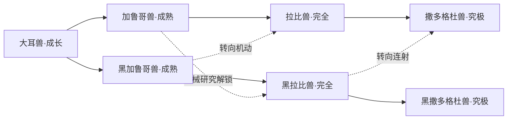

# 大耳兽加入方案（已接入项目）

将大耳兽设为开局直接可选的第三位伙伴，与基尔兽、妖狐兽组成御三家。第一版增加 7 个形态、2 个究极体终点，以连射与蓄能形成独立玩法。以下连接、进化条件、卡牌效果和被动为本作设计，不照搬动画或《日光／月光》的进化表。首版已实现；两条主路线通过固定策略的三章完整游玩验证，后续仍可根据实际体验调整平衡。

## 1. 御三家的区别

| 初始伙伴 | 核心玩法 | 选牌方向 |
| --- | --- | --- |
| 基尔兽 | 灼烧、引爆、自损 | 持续伤害与爆发 |
| 妖狐兽 | 符印、解印、复制 | 技能组合与循环 |
| 大耳兽 | 连射、蓄能、炮击 | 多次攻击，或防守后集中输出 |

复用现有“蓄能”，不再额外加入弹药、热量等资源。蓄能跨回合保留，战斗结束清空；连射按卡牌伤害段数结算，进化统计按出牌次数计算。

## 2. 横向进化树

标准路线：加鲁哥兽连射 → 拉比兽抽牌与机动 → 撒多格杜兽多段火力。

黑色路线：黑加鲁哥兽攻防衔接 → 黑拉比兽防守蓄能 → 黑撒多格杜兽重炮爆发。黑色形态是独立选择，不设置成失败进化或惩罚路线。

允许在下一次进化时转线，不允许随时免费切换已选形态。继承技能保留，让之前选的牌仍有价值。第一版不加入黄金拉比兽；后续作为装甲进化另行设计，避免混淆成长阶段。

## 3. 本局条件与跨局解锁

沿用阶段门槛：成熟期在第一章第 4 层且胜利至少 2 场；完全体在击败第一章首领后；究极体在击败第二章首领后。下表条件叠加在阶段门槛上。

| 连接 | 本局额外条件 | 跨局条件 |
| --- | --- | --- |
| 大耳兽 → 加鲁哥兽 | 无，作为基础路线 | 无 |
| 大耳兽 → 黑加鲁哥兽 | 攻击出牌 6 次，获得护盾的出牌 4 次 | 无 |
| 加鲁哥兽／黑加鲁哥兽 → 拉比兽 | 无，可转向机动 | 无 |
| 黑加鲁哥兽 → 黑拉比兽 | 防御出牌 10 次，主动蓄能出牌 4 次 | 无 |
| 加鲁哥兽 → 黑拉比兽 | 同上 | 解锁“机械研究” |
| 拉比兽／黑拉比兽 → 撒多格杜兽 | 无，保留进化出口 | 无 |
| 黑拉比兽 → 黑撒多格杜兽 | 防御出牌 18 次，成功消耗蓄能的炮击 3 次 | 无 |

“机械研究”：齿轮兽或安杜路兽扫描达到 100%，或完成第二章机械研究事件，永久解锁特殊连接；不自动完成本局行为条件。两条主路线首局均可达，大耳兽本身不需要扫描解锁。

统计规则：一次多段攻击只计一次攻击；带护盾与蓄能的牌可分别推进两项条件；零蓄能炮击不计“成功消耗”。复制牌可推进行为次数，但不推进指定卡牌系列次数。沿用每场分类上限 10 次，新增蓄能与炮击统计同样限额，防止单场刷满。条件不足时可选基础出口，或保留当前形态，在营地用一次行动补进化。

所有前置行为均能由初始牌完成，不会要求使用目标形态才解锁的技能。界面同时显示本局进度（如“防御 7/10”）与跨局路线是否解锁。

## 4. 卡组与形态收益

初始 10 张：攻击指令 ×3、防御插件 ×3、蓄能指令 ×1、脉冲炮 ×1、大耳兽专属“小型龙卷风” ×1、“炽热气弹” ×1。两张专属名称为工作译名；效果为游戏改编。

| 示例卡 | 解锁形态 | 首版效果 |
| --- | --- | --- |
| 小型龙卷风 | 大耳兽 | 1 费，对所有敌人造成 4 伤害 |
| 炽热气弹 | 大耳兽 | 1 费，造成 8 伤害；若有蓄能，额外造成 2 伤害，不消耗蓄能 |
| 加特林机枪 | 加鲁哥兽 | 1 费，造成 3×3 段伤害 |
| 重装齐射（自拟战术名） | 黑撒多格杜兽 | 2 费，造成 12 伤害；消耗全部蓄能，每层额外 5 伤害；耗竭 |

已接入 14 张形态专属牌，每个形态 2 张；上表为效果样例，自拟技能使用“战术”命名，伏击勾拳为黑加鲁哥兽勾拳的战术改编。通用蓄能与炮击继续使用已有简洁物件插画。专属牌展示对应数码兽，仅在本局进化到该形态后进入奖励／商店，旧形态已获得的牌标为“继承技能”。

形态被动建议（只启用当前形态被动，不逐级叠加）：

- 加鲁哥兽：每回合第二张攻击牌结算后，获得 1 蓄能。
- 黑加鲁哥兽：每回合首次打出带护盾的牌后，本回合下一张造成直接伤害的攻击牌额外造成 2 总伤害，不按段放大。
- 拉比兽：每回合第二张攻击牌结算后，抽 1 张牌。
- 黑拉比兽：每回合首次防御出牌额外获得 1 蓄能。
- 撒多格杜兽：每回合第二张攻击牌结算后，获得 1 蓄能并抽 1 张牌。
- 黑撒多格杜兽：每回合首次防御出牌额外获得 1 蓄能；首次成功消耗蓄能后，获得 6 护盾。

被动生成的蓄能不计“主动蓄能出牌”，避免自动满足行为条件。优先验证现有强化、力量和散热芯片对多段攻击的叠加收益，控制伤害上限；卡面应展示强化后的单段伤害与段数。

## 5. 手机界面与资源

开局页显示三位伙伴，手机采用三张纵向紧凑卡片，头像、玩法标签和选择按钮都保持可点击尺寸。进化树保持左到右的四阶段布局，手机横向滑动；点击节点查看条件、被动和专属牌。虚线表示转线，并提供图例，避免误认为额外阶段。

大耳兽及新增形态接入现有伙伴图鉴、卡组查看与技能来源说明。老存档补齐新字段默认值，原有局不强制重开；新一局即可选择大耳兽。

现有本地原始素材库已找到大耳兽、加鲁哥兽、拉比兽、黑拉比兽、撒多格杜兽、黑撒多格杜兽六种素材；黑加鲁哥兽已补入官方静态立绘，并记录在素材来源文件中。七个形态的游戏图片均已接入；六种像素动画，一种静态立绘。

第一版开发范围：7 个形态、2 条主路线、3 条转线、14 张专属牌、2 项新增行为统计，以及御三家入口、进化树、图鉴和存档兼容。优先复用现有道具与祝福，不依赖新增道具才能成型。

验收：两条主路线均能从初始牌组实际到达究极体；研究解锁能跨局保留；未进化形态的技能不会提前掉落；转线保留旧技能且不开放未访问分支；手机端可清楚选择三只伙伴、查看条件与完整卡组。

## 设定参考

- [官方大耳兽图鉴](https://digimon.net/reference/detail.php?directory_name=terriermon)：成长阶段、龙卷风与气弹招式。
- [官方拉比兽图鉴](https://digimon.net/reference/detail.php?directory_name=rapidmon)：完全体、加鲁哥兽进化、高速机动与导弹。
- [官方黑加鲁哥兽图鉴](https://digimon.net/reference/detail.php?directory_name=blackgalgomon)：成熟期、战术与精确攻击特征。
- [官方黑撒多格杜兽图鉴](https://digimon.net/reference/detail.php?directory_name=blacksaintgalgomon)：究极体、低机动重火力与反击特征。

上述资料用于核对形态设定，不代表官方认可本作自定义进化连接或卡牌规则。

## 本轮实现与验证（2026-09-27）

- 大耳兽开局生命 86，初始 10 张牌；继承能力可选坚守／灵巧。
- 新增多段专属牌强化为每段＋1，避免直接套用每段＋3导致收益过高；卡面与实际结算一致。
- 伙伴图鉴新增可展开的搭档形态列表，共 22 种；御三家无需扫描。
- 兼容现有版本 1／2 存档，新战斗字段自动补默认值；不重置原有旅途。
- 95 项测试通过，包括两条大耳兽主路线实际完成三章、原四条终点回归、新统计限额与旧存档读取；类型检查、静态检查、生产构建通过。
- 浏览器实际检查：390px 手机视口选择大耳兽、横向进化树、黑色分支进度追踪、卡组技能来源、蓄能＋气弹伤害、刷新后续玩、图鉴全部图片；320px 图鉴与 1280px 首页无页面横向溢出，控制台未发现错误。
- 以上手机检查使用浏览器视口模拟，未做真机验证。黑加鲁哥兽当前使用静态图。
